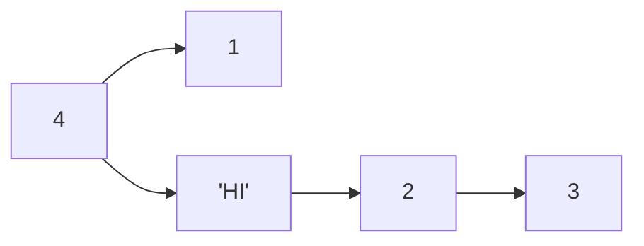

>Header

\#은 Header를 의미합니다. 
 
# H1 태그 

## H2 태그

### H3 태그

#### H4 태그 

##### H5 태그

\#를 5개 이상 쓴다는 것? -> 잘못된 분류!! 

---
>문자체

_ITALIC_

*HELLO*

**bold**

**_italic+bold_**

~~hello~~

>안녕하세요 이건 Quote 입니다. 

>마크다운 문법 배우기!  by **김정인**

---
> 1. Unordered list 

- list 1
* list 2 
    - list 3
        - list 4 
> 2. Ordered list 

1. list 1
2. list 2 
3. list 3 
    1. A
        2. B 


> graph 만들기 

|제목|description|비고| 
|-|-|-|
|안녕 |1        |2 |
|안녕 |2        |3 |

---

>link

\[링크이름](naver.com)

[junginkim의 블로그]
(junginkim23.github.io)

\#html 문법
\<a href="junginkim23.github.io">링크이름</a>

>이미지

\


---
>백슬래쉬

`simple code`

\cpp -> 사용하는 언어에 맞게 코드가 하이라이트 된다. 
```cpp
#include <stdio.h>

int main(){
    printf("hello world");
    return 0;
}
```
---

>수식 표현

$ a^2_1 + b^2 = c^2 $

$$(\alpha + \beta)^2 = \alpha^2 + 2 \alpha \beta + \beta^2$$

$$\alpha \beta \frac{1}{2}$$

---
>mermaid(diagram 표현)


